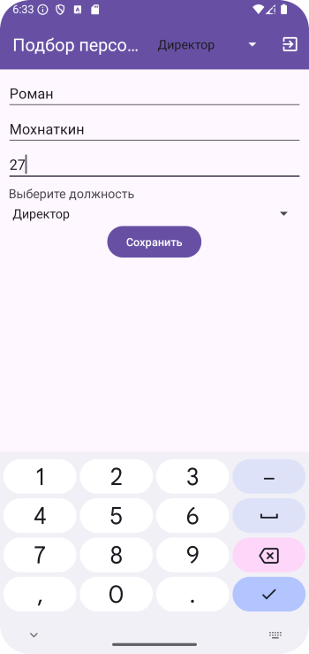
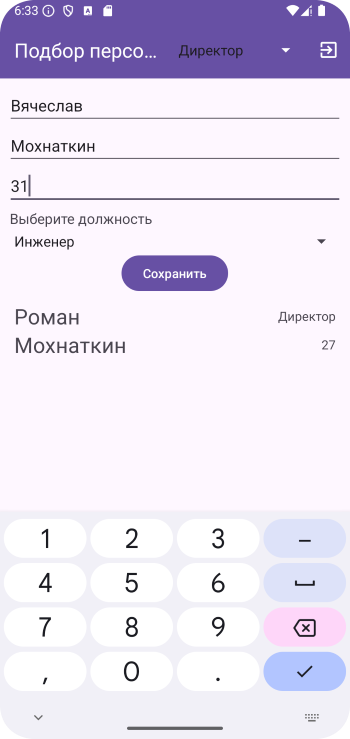
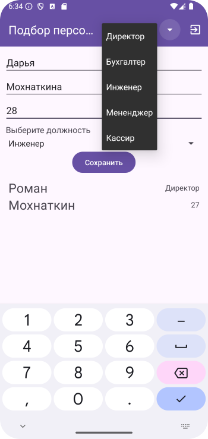
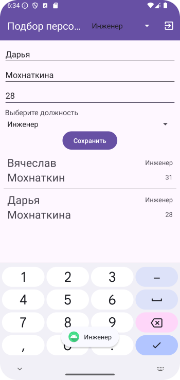
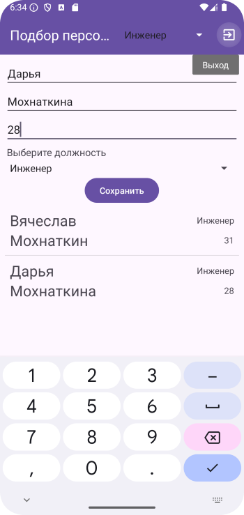

# Домашнее задание по теме "Spinner"

### Программа «Подбор персонала»

Написать программу, содержащую список по подбору персонала на предприятие. Кроме ввода основных данных, необходимо указывать должность на какую поступает работать объект. Здесь необходимо использовать выпадающий список **Spinner**. Cписок должностей составляется на Ваше усмотрение и в зависимости от сферы трудовой деятельности, придуманной Вами. Сохраняем в списке работников по нажатию на кнопку **«Сохранить»**. Сохраненный новый работник появляется в списке работников. Поля ввода при добавлении очищаются.

Данные имени и фамилии в ячейке списка должны быть крупным шрифтом друг под другом, должность и возраст находятся в правой стороне ячейки списка мелким шрифтом, друг под другом.

Работников можно удалять по нажатию на элемент списка с работником, которого нужно удалить.

При выборе пункта меню «Exit» приложение закрывается.

На экране необходимо создать:

1. **Toolbar** с заголовком **«Подбор персонала»**.

2. Поля ввода: имени, фамилии, возраста и должности согласно штатному расписанию (для выбора должности использовать **Spinner**).

3. Кнопку **«Сохранить»**.

4. **ListView**, в который будут помещены созданные работники.

5. Меню с одним пунктом **«Exit»**.

Для удобства работы необходимо создать класс **Person** с конструктором, в котором содержатся свойства имени, фамилии, возраста и должности.

**\*\*\* Необязательно, но желательно (усложненный уровень).**

В приложении есть возможность сортировать список по должности и менять список, включающий всех работников на экране на список относительно выбранной должности. Для этого в **Toolbar** помещен **Spinner**, который включает список основных должностей. Т.е. в списке сохранены, допустим, два инженера, три конструктора, четыре энергетика. Мы в **Spinner Toolbar** выбираем **«Конструктор»** и список фильтруется и перерисовывается так, что на экране остаются только три конструктора.

Приложение необходимо сохранить проектом в удаленном репозитории, для проверки качества предоставить ссылку преподавателю, либо сделать скрины эмулятора при каждом шаге работы приложения или видео работы реального устройства.

### Скриншоты домашнего задания по теме "Spinner"

Скриншоты домашнего задания

